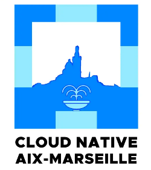

Pour cette soirée exceptionelle, le MarsJUG et le Cloud Native Aix Marseille reçoivent Alain Régnier ! 

 +  

Deux sujets seront présentés par Alain:
## Utiliser Kubernetes en 2025

Plus de 10 ans après sa sortie en 2014, Kubernetes a beaucoup changé. Pourtant beaucoup d'entreprises continuent d'utiliser Kubernetes de la même manière depuis des années.  

Au cours de cette présentation, nous ferons le tour de choses à connaître pour ne pas utiliser Kubernetes en 2025 comme si on était encore en 2015... (Gateway, kubectl debug, CRD et Operator, CSI et Volume Snapshots, partage de GPU, Image Volumes, eBPF, CEL pour le contrôle d'admission, request/limits au niveau des Pods, Kueue pour gérer les jobs, sécurité, ...)  
  

## Récap KubeCon 2025 à Atlanta
Cette partie sera focalisée sur la KubeCon 2025 à Atlanta dont Alain sera fraichement revenu et présentera la conférence, les grandes annonces et les nouveautés à venir de l'ecosystème Kubernetes.
